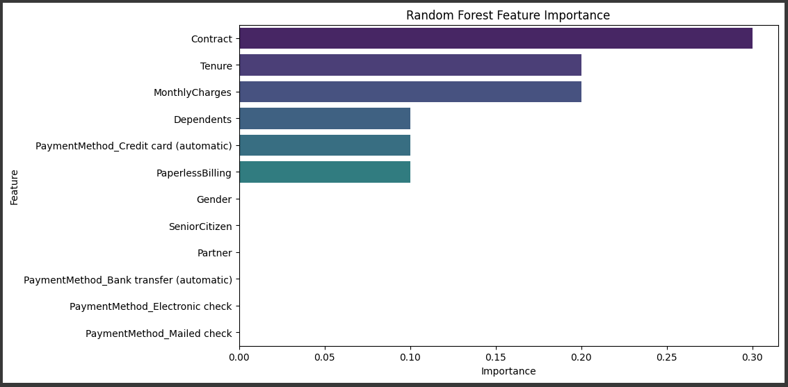

# Customer Churn Prediction with Hyperparameter Tuning

## 📌 Overview

This project aims to build a reliable **customer churn prediction model** using machine learning techniques and **hyperparameter tuning with cross-validation**. The goal is not only to maximize performance metrics but also to **interpret results for actionable business insights**.

* **Business Objective**: Detect customers who are likely to churn in order to design targeted retention strategies.
* **Approach**: Data preprocessing, feature engineering, encoding, scaling, model training, hyperparameter tuning, and evaluation.
* **Best Model Identified**: Random Forest (Balanced + Tuned), optimized for **Recall** to minimize false negatives.

---

## 📌 Key Takeaways

* **Data imbalance** requires careful metric selection (Recall & F1 over Accuracy).
* **Hyperparameter tuning** significantly improves model performance.
* **Random Forest (Balanced + Tuned)** is the best choice for this churn prediction case.

---

## 📊 Dataset

The dataset contains customer subscription details, demographics, and billing information.

**Data Dictionary (selected columns):**

| Column           | Description                                            |
| ---------------- | ------------------------------------------------------ |
| `customerID`     | Unique customer ID                                     |
| `Gender`         | Gender (Male/Female)                                   |
| `SeniorCitizen`  | Senior citizen flag (0 = No, 1 = Yes)                  |
| `Partner`        | Has a partner (Yes/No)                                 |
| `Dependents`     | Has dependents (Yes/No)                                |
| `Tenure`         | Duration of subscription (months)                      |
| `Contract`       | Contract type (Month-to-month, One year, Two year)     |
| `PaymentMethod`  | Payment method (e.g., Electronic check, Bank transfer) |
| `MonthlyCharges` | Monthly charges                                        |
| `TotalCharges`   | Total charges                                          |
| `Churn`          | Target variable (Yes/No)                               |

---

## ⚙️ Workflow

1. **Data Understanding & Cleaning**

   * Removed duplicates and irrelevant columns (`customerID`)
   * Handled missing values (median for numerical, mode for categorical)
   * Encoded categorical variables (Label Encoding, Ordinal Encoding, One-Hot Encoding)

2. **Exploratory Data Analysis (EDA)**

   * Distribution plots for categorical and numerical features
   * Correlation analysis and feature reduction (dropped `TotalCharges`)

3. **Feature Engineering**

   * Scaling applied to numerical variables (`MonthlyCharges`, `Tenure`)

4. **Modeling & Hyperparameter Tuning**
   Models tested:

   * Logistic Regression
   * Decision Tree
   * Random Forest
   * XGBoost

   Metrics evaluated: **Accuracy, Precision, Recall, F1, AUC**

   * Special focus on **Recall & F1** (due to class imbalance).

5. **Best Model Selection**

   * **Random Forest (Balanced + Tuned)** achieved the highest Recall (0.87)
   * Trade-off: Lower Precision, but Recall is prioritized to reduce false negatives.

6. **Final Evaluation**

   * Evaluation on test set with Confusion Matrix, Classification Report, and AUC-ROC
      * **Final Test Accuracy: 0.67, AUC-ROC: 0.81** The model is suitable for **retention strategy**, especially for predicting customers at risk of churn based on contract factors & monthly costs.
   * Feature Importance & Permutation Importance analysis
     * **Contract structure** play the biggest role in customer retention. Offering discounts for longer-term contracts may reduce churn.

---

## 🚀 Results & Model Performance

### 📈 Cross-validation Summary (Top Models):

| Model                        | Version   | Accuracy | Precision | Recall | F1   |
|-------------------------------|-----------|----------|-----------|--------|------|
| Logistic Regression           | Baseline  | 0.738    | 0.505     | 0.802  | 0.619 |
| Logistic Regression Balanced  | Tuned     | 0.741    | 0.508     | 0.790  | 0.618 |
| Decision Tree                 | Baseline  | 0.733    | 0.498     | 0.491  | 0.494 |
| Decision Tree Balanced        | Tuned     | 0.735    | 0.501     | 0.782  | 0.610 |
| Random Forest                 | Baseline  | 0.770    | 0.588     | 0.453  | 0.511 |
| **Random Forest Balanced**    | **Tuned** | **0.678**| **0.446** | **0.867** | **0.589** |
| XGBoost                       | Baseline  | 0.780    | 0.600     | 0.511  | 0.552 |
| XGBoost Balanced              | Tuned     | 0.787    | 0.619     | 0.513  | 0.561 |

  * Prioritizing Recall ensures more churn cases are detected.
  * Better to wrongly target some non-churn customers than miss actual churners.
    
➡️ **Best Model (based on Recall):** Random Forest (Balanced, Tuned)  
- **Accuracy:** 0.678  
- **Precision:** 0.446  
- **Recall:** 0.867  
- **F1:** 0.589  

---

### 📊 Final Evaluation (Test Set)

- **Classification Report:**
               precision    recall  f1-score   support

           0       0.92      0.60      0.73      1033
           1       0.44      0.86      0.58       374

    accuracy                           0.67      1407
   macro avg       0.68      0.73      0.65      1407
weighted avg       0.79      0.67      0.69      1407

AUC-ROC: 0.8055556993544581

  - TP: 622  
  - FP: 411  
  - TN: 321  
  - FN: 53
  📌 **Insight:**
      - ✅ The model successfully captures the majority of true churners → useful for retention campaigns.  
      - ⚠️ Low precision for churn (44%) → many false positives, meaning higher campaign costs since many “healthy” customers are incorrectly targeted.
        
---

## 🔍 Feature Importance Insights

- **Contract (~30%)** → the most dominant factor, strongly influencing churn probability.  
- **Tenure & MonthlyCharges (~20%)** → new customers with higher monthly costs are more likely to churn.  
- **Dependents, Payment Method (Credit Card), PaperlessBilling (~10%)** → moderate influence.  
- Other features → minimal impact.  

.png)
- Contract dominates significantly compared to other factors, confirming that **contract type is the primary determinant of churn**.

**Business Takeaways:**
The type of customer contract is the strongest driver of churn. Customers on month-to-month contracts are much more likely to leave compared to those with longer-term agreements. This suggests that businesses should focus on promoting longer-term contracts (e.g., 6–12 months) through discounts or added benefits.
Additionally, new customers with high monthly charges are at higher risk, so onboarding support and targeted retention offers can help reduce early churn. Factors like dependents, billing methods, and paperless billing have moderate influence but are secondary compared to contract and pricing strategy.

---

## Thank You
**👤 Author**

**Suciningtyas Nur Alifah**

